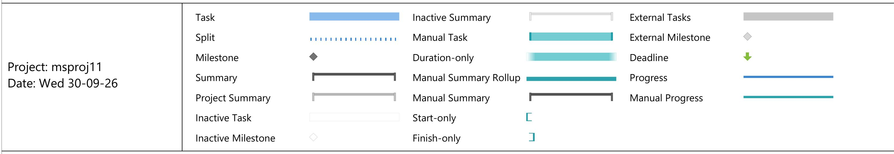
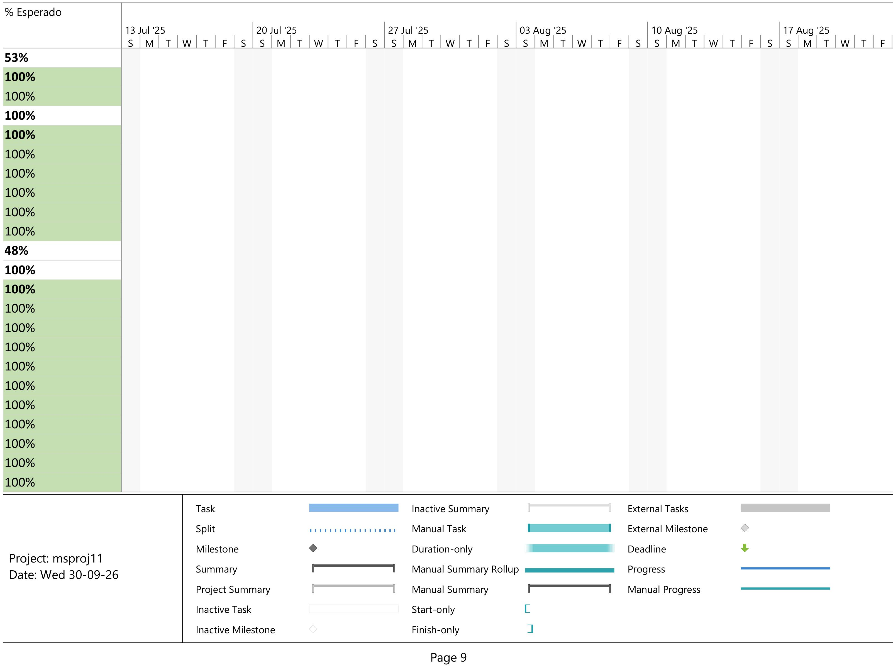
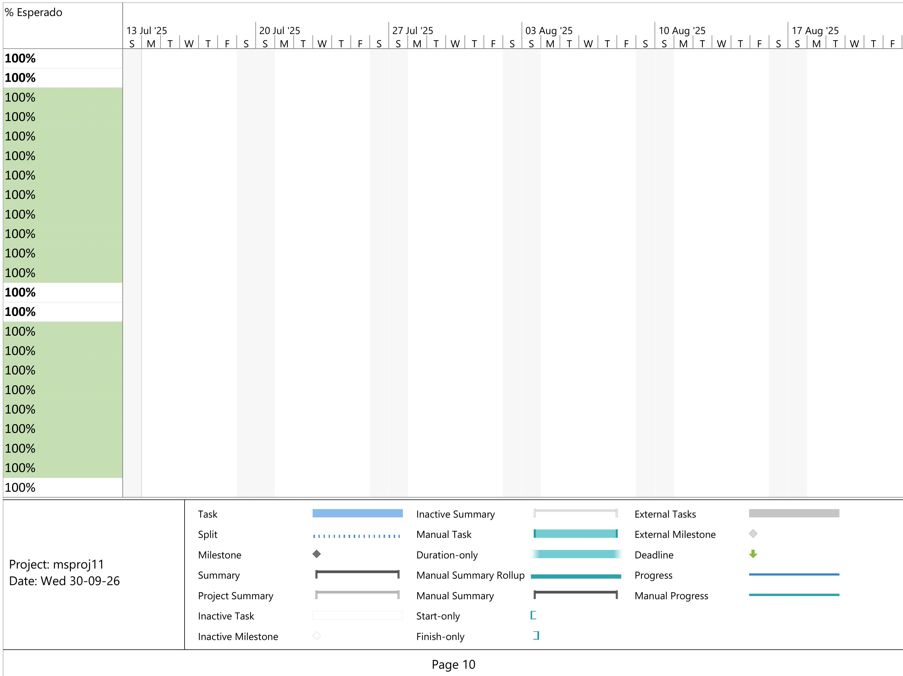

<table><tr><td>ID</td><td>Task Mode</td><td>Task Name</td><td>Duration</td><td>Start</td><td>Finish</td><td colspan="2">Prede% Complete</td></tr><tr><td>114</td><td>✓</td><td>Induccion de HU</td><td>1 day</td><td>Thu 01-10-26</td><td>Thu 01-10-26</td><td>111</td><td>100%</td></tr><tr><td>115</td><td>✓</td><td>Ejecucion de pruebas ciclo 1</td><td>1 day</td><td>Fri 02-10-26</td><td>Fri 02-10-26</td><td>114</td><td>100%</td></tr><tr><td>116</td><td>✓</td><td>Reuniones de Revisión UAT</td><td>1 day</td><td>Mon 05-10-26</td><td>Mon 05-10-26</td><td>115</td><td>100%</td></tr><tr><td>117</td><td>✓</td><td>Correcciones y despliegue</td><td>1 day</td><td>Tue 06-10-26</td><td>Tue 06-10-26</td><td>116</td><td>100%</td></tr><tr><td>118</td><td>✓</td><td>Ejecucion de pruebas ciclo 2</td><td>1 day</td><td>Wed 07-10-26</td><td>Wed 07-10-26</td><td>117</td><td>100%</td></tr><tr><td>119</td><td>✓</td><td>HU Garantía: 2.5, 6.1, 8.6, 14.3, 19.1, 19.2, 23.1, 24.4, 24.5, 26.1, 34.1, 38.4, 41.2, 42.2</td><td>24 days</td><td>Thu 01-10-26</td><td>Wed 04-11-26</td><td>111</td><td>13%</td></tr><tr><td>120</td><td>✓</td><td>Medición de Esfuerzo</td><td>1 day</td><td>Thu 01-10-26</td><td>Thu 01-10-26</td><td>111</td><td>100%</td></tr><tr><td>121</td><td>✓</td><td>Análisis, Revision y Aprobacion</td><td>1 day</td><td>Thu 01-10-26</td><td>Thu 01-10-26</td><td>111</td><td>100%</td></tr><tr><td>122</td><td>✓</td><td>Desarrollo</td><td>15 days</td><td>Thu 01-10-26</td><td>Thu 22-10-26</td><td>111</td><td>10%</td></tr><tr><td>123</td><td>✓</td><td>Pruebas Internas</td><td>1 day</td><td>Fri 23-10-26</td><td>Fri 23-10-26</td><td>122</td><td>0%</td></tr><tr><td>124</td><td>✓</td><td>Entrega y despliegue en QA</td><td>1 day</td><td>Mon 26-10-26</td><td>Mon 26-10-26</td><td>123</td><td>0%</td></tr><tr><td>125</td><td>✓</td><td>Induccion de HU</td><td>1 day</td><td>Mon 26-10-26</td><td>Mon 26-10-26</td><td>123</td><td>0%</td></tr><tr><td>126</td><td>✓</td><td>Ejecucion de pruebas ciclo 1</td><td>2 days</td><td>Tue 27-10-26</td><td>Wed 28-10-26</td><td>125</td><td>0%</td></tr><tr><td>127</td><td>✓</td><td>Reuniones de Revisión UAT</td><td>1 day</td><td>Thu 29-10-26</td><td>Thu 29-10-26</td><td>126</td><td>0%</td></tr><tr><td>128</td><td>✓</td><td>Correcciones y despliegue</td><td>2 days</td><td>Fri 30-10-26</td><td>Mon 02-11-26</td><td>127</td><td>0%</td></tr><tr><td>129</td><td>✓</td><td>Ejecucion de pruebas ciclo 2</td><td>2 days</td><td>Tue 03-11-26</td><td>Wed 04-11-26</td><td>128</td><td>0%</td></tr><tr><td>130</td><td>✓</td><td>47 Casos Mejoras trasnversales</td><td>48,2 days</td><td>Wed 23-09-26</td><td>Tue 01-12-26</td><td></td><td>24%</td></tr><tr><td>131</td><td>✓</td><td>NOK: 14.2, 14.3, 15.1, 15.2</td><td>7,2 days</td><td>Wed 23-09-26</td><td>Fri 02-10-26</td><td></td><td>100%</td></tr><tr><td>132</td><td>✓</td><td>Medición de Esfuerzo</td><td>1 day</td><td>Wed 23-09-26</td><td>Wed 23-09-26</td><td>77</td><td>100%</td></tr><tr><td>133</td><td>✓</td><td>Análisis, Revision y Aprobacion</td><td>1 day</td><td>Wed 23-09-26</td><td>Wed 23-09-26</td><td>77</td><td>100%</td></tr><tr><td>134</td><td rowspan="8">✓</td><td rowspan="8">Desarrollo</td><td>1 day</td><td>Wed 23-09-26</td><td>Fri 25-09-26</td><td>77</td><td>100%</td></tr><tr><td colspan="3" rowspan="7">Project: msproj11 Date: Wed 30-09-26</td><td>Task</td><td>Inactive Summary</td><td>External Tasks</td><td></td><td></td></tr><tr><td>Split</td><td>Manual Task</td><td>External Milestone</td><td></td><td></td></tr><tr><td>Milestone</td><td>Duration-only</td><td>Deadline</td><td></td><td></td></tr><tr><td>Summary</td><td>Manual Summary Rollup</td><td>Progress</td><td></td><td></td></tr><tr><td>Project Summary</td><td>Manual Summary</td><td>Manual Progress</td><td></td><td></td></tr><tr><td>Inactive Task</td><td>Start-only</td><td></td><td></td><td></td></tr><tr><td>Inactive Milestone</td><td>Finish-only</td><td></td><td></td><td></td></tr><tr><td colspan="8">Page 6</td></tr></table>

<table><tr><td>ID</td><td>Task Mode</td><td>Task Name</td><td>Duration</td><td>Start</td><td>Finish</td><td>Prede% Complete</td><td></td></tr><tr><td>135</td><td>✓</td><td>Pruebas Internas</td><td>1 day</td><td>Thu 24-09-26</td><td>Fri 25-09-26</td><td>134</td><td>100%</td></tr><tr><td>136</td><td>✓</td><td>Entrega y despliegue en QA</td><td>1 day</td><td>Fri 25-09-26</td><td>Mon 28-09-26</td><td>135</td><td>100%</td></tr><tr><td>137</td><td>✓</td><td>Inducción de HU</td><td>1 day</td><td>Fri 25-09-26</td><td>Mon 28-09-26</td><td>135</td><td>100%</td></tr><tr><td>138</td><td>✓</td><td>Ejecución de pruebas ciclo 1</td><td>1 day</td><td>Mon 28-09-26</td><td>Tue 29-09-26</td><td>137</td><td>100%</td></tr><tr><td>139</td><td>✓</td><td>Reuniones de Revisión UAT</td><td>1 day</td><td>Tue 29-09-26</td><td>Wed 30-09-26</td><td>138</td><td>100%</td></tr><tr><td>140</td><td>✓</td><td>Correcciones y despliegue</td><td>1 day</td><td>Wed 30-09-26</td><td>Thu 01-10-26</td><td>139</td><td>100%</td></tr><tr><td>141</td><td>✓</td><td>Ejecución de pruebas ciclo 2</td><td>1 day</td><td>Thu 01-10-26</td><td>Fri 02-10-26</td><td>140</td><td>100%</td></tr><tr><td>142</td><td>✓</td><td>HU Garantía: 11, 19, 21, 25, 26, 27, 29, 32, 33, 38, 39</td><td>43 days</td><td>Wed 30-09-26</td><td>Tue 01-12-26</td><td>139</td><td>7%</td></tr><tr><td>143</td><td>✓</td><td>Medición de Esfuerzo</td><td>1 day</td><td>Wed 30-09-26</td><td>Thu 01-10-26</td><td>139</td><td>100%</td></tr><tr><td>144</td><td>✓</td><td>Análisis, Revision y Aprobación</td><td>1 day</td><td>Wed 30-09-26</td><td>Thu 01-10-26</td><td>139</td><td>100%</td></tr><tr><td>145</td><td>✓</td><td>Desarrollo</td><td>28 days</td><td>Wed 30-09-26</td><td>Tue 10-11-26</td><td>139</td><td>5%</td></tr><tr><td>146</td><td>✓</td><td>Pruebas Internas</td><td>5 days</td><td>Tue 10-11-26</td><td>Tue 17-11-26</td><td>145</td><td>0%</td></tr><tr><td>147</td><td>✓</td><td>Entrega y despliegue en QA</td><td>1 day</td><td>Tue 17-11-26</td><td>Wed 18-11-26</td><td>146</td><td>0%</td></tr><tr><td>148</td><td>✓</td><td>Inducción de HU</td><td>1 day</td><td>Tue 17-11-26</td><td>Wed 18-11-26</td><td>146</td><td>0%</td></tr><tr><td>149</td><td>✓</td><td>Ejecución de pruebas ciclo 1</td><td>5 days</td><td>Wed 18-11-26</td><td>Wed 25-11-26</td><td>148</td><td>0%</td></tr><tr><td>150</td><td>✓</td><td>Reuniones de Revisión UAT</td><td>1 day</td><td>Wed 25-11-26</td><td>Thu 26-11-26</td><td>149</td><td>0%</td></tr><tr><td>151</td><td>✓</td><td>Correcciones y despliegue</td><td>2 days</td><td>Thu 26-11-26</td><td>Mon 30-11-26</td><td>150</td><td>0%</td></tr><tr><td>152</td><td>✓</td><td>Ejecución de pruebas ciclo 2</td><td>1 day</td><td>Mon 30-11-26</td><td>Tue 01-12-26</td><td>151</td><td>0%</td></tr><tr><td>153</td><td>✓</td><td>PAP 2</td><td>0 days</td><td>Tue 01-12-26</td><td>Tue 01-12-26</td><td></td><td>0%</td></tr><tr><td>154</td><td>✓</td><td>Coordinacion PAP</td><td>0 days</td><td>Tue 01-12-26</td><td>Tue 01-12-26</td><td>152</td><td>0%</td></tr><tr><td>155</td><td>✓</td><td>Ejecución PAP</td><td>0 days</td><td>Tue 01-12-26</td><td>Tue 01-12-26</td><td>154</td><td>0%</td></tr><tr><td>156</td><td rowspan="8">✓</td><td rowspan="8">Documentación Actualización</td><td>7 days</td><td>Wed 25-11-26</td><td>Fri 04-12-26</td><td>149</td><td>0%</td></tr><tr><td colspan="3" rowspan="7">Project: msproj11 Date: Wed 30-09-26</td><td>Task</td><td>Inactive Summary</td><td>External Tasks</td><td></td><td></td></tr><tr><td>Split</td><td>Manual Task</td><td>External Milestone</td><td></td><td></td></tr><tr><td>Milestone</td><td>Duration-only</td><td>Deadline</td><td></td><td></td></tr><tr><td>Summary</td><td>Manual Summary Rollup</td><td>Progress</td><td></td><td></td></tr><tr><td>Project Summary</td><td>Manual Summary</td><td>Manual Progress</td><td></td><td></td></tr><tr><td>Inactive Task</td><td>Start-only</td><td>[</td><td></td><td></td></tr><tr><td>Inactive Milestone</td><td>Finish-only</td><td>]</td><td></td><td></td></tr><tr><td colspan="8">Page 7</td></tr></table>

<table><tr><td>ID</td><td>Task Mode</td><td>Task Name</td><td>Duration</td><td>Start</td><td>Finish</td><td colspan="3">Pred% Complete</td></tr><tr><td>157</td><td>📁</td><td>Documento Técnica Actualización</td><td>3 days</td><td>Wed 25-11-26</td><td>Mon 30-11-26</td><td>149</td><td>0%</td><td></td></tr><tr><td>158</td><td>📁</td><td>Manual de Usuario Actualización</td><td>3 days</td><td>Mon 30-11-26</td><td>Thu 03-12-26</td><td>157</td><td>0%</td><td></td></tr><tr><td>159</td><td>📁</td><td>Aprobaciones Documentos</td><td>1 day</td><td>Thu 03-12-26</td><td>Fri 04-12-26</td><td>158</td><td>0%</td><td></td></tr></table>

